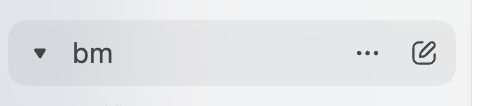
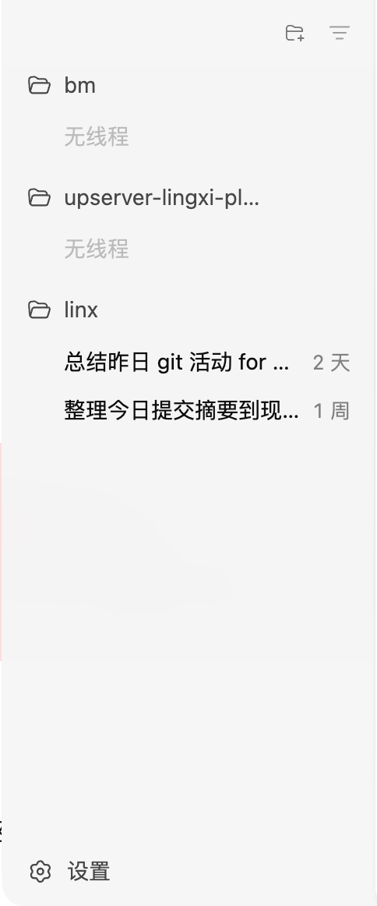

# 侧边栏设计

## 概述

侧边栏是 Cloak 的导航和操作区域，用于显示项目、会话和设置等信息。

## 需求

- 从上到下依次为：项目选择器、项目和会话历史列表、设置按钮
- 项目选择器：点击后弹出项目选择菜单，选择后在项目列表新增选中的项目,例如图中的 `bm` 项目
- 项目名称超过一定宽度后显示省略号
- 鼠标 hover 到项目名称时，有高亮显示（背景灰色，右边显示更多（...） 和新增会话 icon）
  - 参考图为：
- 点击项目名称后可以对项目的会话进行折叠与展开，折叠后显示文件夹关闭的图标，展开后显示文件夹打开的图标和会话列表
- 图标统一用 lucide-react 中的图标
- 会话列表如图所示。

如图所示：